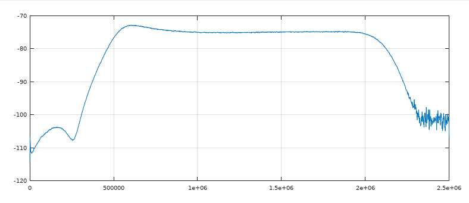
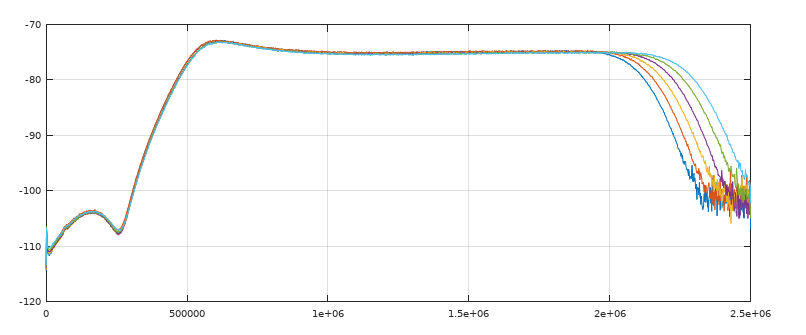
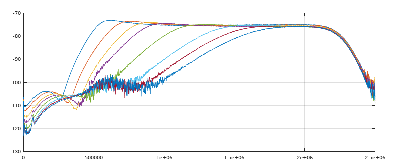

# Playing with the Airspy RTL820 IF bandwidth 

## Introduction
The airspy SDR consists essentially in a RT820 tuner followed by a 12bits DAC, with an ARM SOC to control all that and send data via USB.

In contrary to classical DVB-T RTL-SDR, the airspy don't output an IQ stream natively. The DAC under-samples the IF output of the RT820 tuner at 5Ms/s or 20Ms/s. A conversion to IQ could be done in the libairspy by the host CPU. It's the application that choose what is the best format to use, converted IQ stream or "real" data without conversion, depending of its needs.

In the following, we will use only the "real" mode at 5Ms/s to test what we could expect from the programmable IF filter of the RT820.To do that, we will use a noise source directly connected to the airspy and airspy_rx to save the received data to a file in raw real mode :

> ./airspy_rx -f 136 -a 5000000 -p 1 -g 10 -n 10000000 -t 1 -r test.raw

Then we will use the octave mathematical software to read the saved file and use the pwelsh function to display the noise power vs frequency :

Man could clearly see the IF filter in action . The airspy firmware have programmed it in order to use most of the available 2.5Mhz bandwidth and to be as symmetric as possible around Fs/4 (see later).

## Modifying IF bandwidth
Thanks to the libairspy rtl830_set_register function, it is possible to change the setting of the IF filter. So, I modified the airspy_rx command by adding parameters to set the two RL820 registers (R10 & R11) that control the IF filter, as wanted.

Tree different parameters could be set in these two registers :
* broad If filter bandwidth : narrow/mid/large
* manual fine tuning IF filter bandwidth from 0 (large) to 15 (narrow)
* high pass filter frequency from 0(high) to 15 (low)

By default, the airspy firmware set theses parameters to narrow/15/15 respectively for 5Mbit/s sampling.

### Broad IF filter bandwidth changes
First, let's try to change the broad if filter bandwidth, keeping fine tuning and high pass filter to 15. We got the following graph :

we could clearly see two things :
1. The filter bandwidth is changed only by changing the upper frequency limit 
2. The increase in level at high frequencies for middle and large position is the sign of aliasing : the filter have an upper frequency above Fs/2 in these positions.

The consequence of 2 is that only the narrower position is usable at Fs=5Ms/s, so we will stay with this value for the following.

### Manual fine tuning IF bandwidth

Let change these parameters from 15 to 10 :

Here, we see that by lowering this parameter, we could increase the usable bandwidth. As previously, if we go too far (less than 11), aliasing appears. But up to 5 different bandwidths could be used. 

| parameter | -3db Hi cut Freq. |
|:--------|:-------:|
| 15 | 2088000 |
| 14 | 2121000 |
| 13 | 2155000 |
| 12 | 2188000 |
| 11 | 2221000 |

Note : I think that the airspy firmware don't use the maximum bandwidth available because it targets more the IQ format than the "real" format, and the IQ conversion need a symmetric bandwidth around Fs/4.

### High-pass filter frequency
The RL820 has more than a band-pass IF filter. It has a programmable high-pass filter too, that could be use to increase the low frequency limit of the IF bandwidth.
Let try to change this parameter from 15 (lower, no effect) to 8 :

We could see, that, thanks to this parameter, we could reduce the bandwidth a lot. For too low values (< 8), the high-pass filter interacts with the IF band-pass filter and the resulting filter starts to not be usable (reduced gain and completely asymmetric filter), but eights values are usable :

| parameter | -3db Low cut Freq. |
|:--------|:-------:|
| 15 | 494600 |
| 14 | 609800 |
| 13 | 718100 |
| 12 | 806400 |
| 11 | 1026900 |
| 10 | 1302400 |
| 9 | 1455700 |
| 8 | 1597900 |

## Conclusion 
When used in "real" mode, man could easily program the RTL820 IF filter to got a large choice of IF bandwidths. 

It could be useful for application like my [acarsdec](https://github.com/TLeconte/acarsdec) and [vdlm2dec](https://github.com/TLeconte/vdlm2dec) programs that generally don't need large bandwidth. For example, in my area, I receive vdlm2 on 4 frequencies : 136.725, 136.775,136.875,136.975 that are relatively close, so I need only a little more than 250Khz bandwidth !

## What next 
I plan to write a function, that given a needed bandwidth, will set the RTL820 registers accordingly and give the low and upper values of the resulting filter. The application will then be able to compute the correct center tuning frequency to have the wanted signals in the IF bandwidth.
This function could potentially be added to libairspy itself, but it is only usable in "real" mode.

As previously said, IQ conversion is done by the libairspy by mixing at Fs/4 and so the IF filter used must be centered around Fs/4 which is not possible for reduced or extended bandwidth(see graphs). A solution will be to rewrite the IQ conversion code to accept other center frequencies, but we will lose the speed optimization that are possible at Fs/4 only. A good compromise could be to use a filter centered on 3/8Fs and down-sample by 4 to get a 1.25Ms/s IQ stream with the advantage of an adapted IF filter :

 

